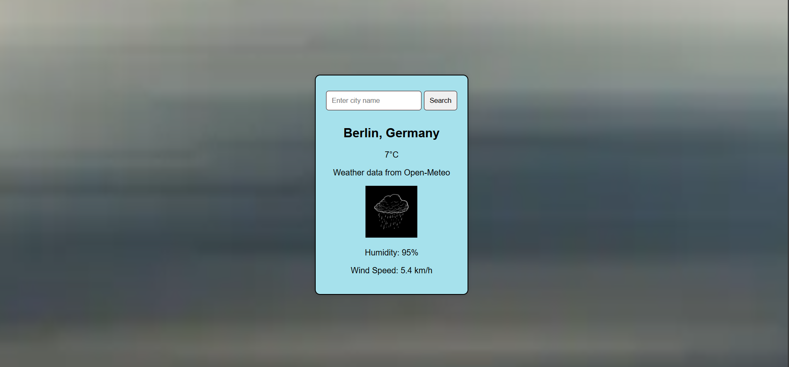

# Weather App 🌦️

This is a simple Weather App that fetches weather data based on the city name using the [Open-Meteo API](https://open-meteo.com/). Users can search for weather information by entering a city name, and the app will display the current weather conditions, including temperature, humidity, and wind speed.



## Features

- Fetches current weather data based on city name.
- Displays temperature, humidity, and wind speed.
- Simple and clean user interface.
- Uses Open-Meteo Geocoding and Weather APIs.

## Technologies Used

- **HTML**: For structuring the content.
- **CSS**: For styling the user interface.
- **JavaScript**: For functionality and interacting with the Open-Meteo API.

## Setup

To set up this project locally, follow these steps:

1. Clone the repository:
   ```bash
   git clone https://github.com/username/weather-app.git
   ```

2. Navigate to the project directory:
   ```bash
   cd weather-app
   ```

3. Open the `index.html` file in your preferred browser.

## Usage

1. Enter the name of the city you want to check the weather for in the input field.
2. Click the "Search" button or press the "Enter" key.
3. The app will display the current weather data for the specified city.

```
